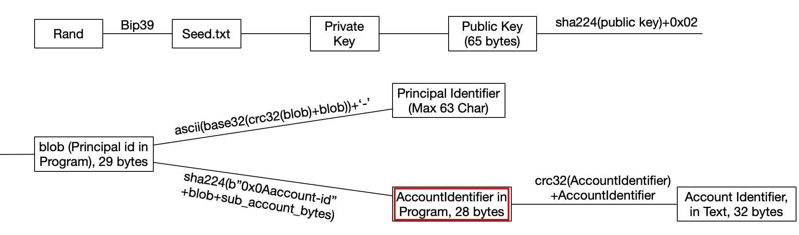

## ERC20 style token template for Dfinity


## TODO

* [error handling](https://sdk.dfinity.org/docs/language-guide/errors.html)
* token standard draft

## Env

1. dfx 0.7.0-beta.6
2. [vessel 0.6.1](https://github.com/dfinity/vessel)

## Docs

https://dfinance.ai/motoko-token/

## Types
### AccountIdentifier
Account Identifier, refer to [Ledger canister](https://github.com/dfinity/ic/blob/master/rs/rosetta-api/ledger_canister/src/account_identifier.rs#L24-L26).   
```mo
/// Account Identitier type.
type AccountIdentifier = { hash : [Nat8] }
```



### Operation 
```mo
/// Update call operations
type Operation = {#mint; #burn; #transfer; #approve; #init}
```

### Status
```mo
/// Update call status
type Status = {#success; #failed}
```

### OpRecord
```mo
/// Update call record fields
type OpRecord = { caller : Text; op : Operation; status : Status; index : Nat; hash : Text; from : ?Text; to : ?Text; amount : Nat64; fee : ?Nat64; memo : ?Nat64; timestamp : Time.Time }
```
### OpRecordIn
```mo
/// OpRecord without hash.
type OpRecordIn = { caller : Text; op : Operation; status : Status; index : Nat; from : ?Text; to : ?Text; amount : Nat64; fee : ?Nat64; memo : ?Nat64; timestamp : Time.Time }
```

## Interface Specification
```motoko
/// Update call 
/// Transfers `value` amount of tokens to Account `to`. `value` is the number of minimum units.   
/// Return whether the result is successful and transaction hash.
public func transfer(to : Text, value : Nat64) : async (Bool, Text)

/// Transfers `value` amount of tokens from Account `from` to Account `to`. `value` is the number of minimum units.     
/// Return whether the result is successful and transaction hash.
public func transferFrom(
  from : Text,
  to : Text,
  value : Nat64
) : async (Bool, Text)

/// Allows `spender` to withdraw from your account multiple times, up to the `value` amount. 
/// If this function is called again it overwrites the current allowance with value.
/// `value` is the number of minimum units.    
/// the `value` of `approve` is has **nothing** to do with your `balance`     
/// Return whether the result is successful and transaction hash.
public func approve(spender : Text, value : Nat64) : async (Bool, Text)

/// Creates `value` tokens and assigns them to Account `to`, increasing the total supply.
/// Return whether the result is successful and transaction hash.
public func mint(to : Text, value : Nat64) : async (Bool, Text)

/// Burn `value` tokens of Account `to`, decreasing the total supply.     
/// Return whether the result is successful and transaction hash.
public func burn(from : Text, value : Nat64) : async (Bool, Text)


/// Query call 
/// Get the balance of Account who, in the number of minimum units.
public func balanceOf(who : Text) : async Nat64

/// Get the amount which `spender` is still allowed to withdraw from `owner`, in the number of minimum units. 
public func allowance(owner : Text, spender : Text) : async Nat64

/// Get the total token supply, in the number of minimum units.
public func totalSupply() : async Nat64

/// Get the name of the token.
public func name() : async Text

/// Get the number of decimals the token uses.
public func decimals() : async Nat64

/// Get the number of decimals the token uses.
public func symbol() : async Text

/// Get the owner of the token
public func owner() : async Text

/// Get update call History index by hash.
public func getHistoryByHash(hash : Text) : async ?OpRecord
Get update call History index by hash.

/// Get update call history by account.
public func getHistoryByAccount(a : Text) : async ?[OpRecord]

/// Get all update call history.
public func allHistory() : async [OpRecord]
```

## Examples

See [demo.sh](./demo.sh).

## Reference

* https://github.com/enzoh/motoko-token
* https://github.com/flyq/motoko_token
* https://github.com/enzoh/motoko-sha
* https://github.com/stephenandrews/motoko-crc
* https://github.com/flyq/motoko-sha224
